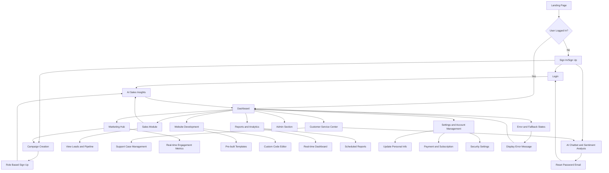

```mermaid
flowchart TD
    A[Landing Page] --> B{User Logged In?}
    B -->|No| C[Sign In/Sign Up]
    B -->|Yes| G[Dashboard]
    
    C --> D[Login]
    C --> S[Sign Up]
    C --> R[Forgot Password]
    
    R --> E[Reset Password Email]
    E --> D[Login]
    
    S --> F[Role Based Sign Up]
    F --> P[Enable 2FA and Onboarding]
    P --> G
    
    D --> P
    
    G --> H[Sales Module]
    G --> I[Customer Service Center]
    G --> J[Marketing Hub]
    G --> K[Website Development]
    G --> L[Reports and Analytics]
    G --> M[Settings and Account Management]
    G --> N[Admin Section]
    
    H --> O[View Leads and Pipeline]
    H --> P[AI Sales Insights]
    
    I --> Q[Support Case Management]
    I --> R[AI Chatbot and Sentiment Analysis]
    
    J --> S[Campaign Creation]
    J --> T[Real-time Engagement Metrics]
    
    K --> U[Pre-built Templates]
    K --> V[Custom Code Editor]
    
    L --> W[Real-time Dashboard]
    L --> X[Scheduled Reports]
    
    M --> Y[Update Personal Info]
    M --> Z[Payment and Subscription]
    M --> AA[Security Settings]
    
    G --> AB[Error and Fallback States]
    AB --> AC[Display Error Message]
    AC --> G
```
